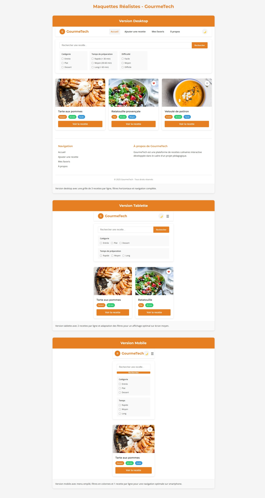

# GourmeTech

GourmeTech est une plateforme de recettes culinaires interactive permettant aux utilisateurs de rechercher, filtrer et sauvegarder leurs recettes préférées.

## Fonctionnalités

- **Navigation intuitive** : Un menu clair pour accéder aux différentes sections du site.
- **Mode sombre / clair** : Possibilité de changer le thème visuel.
- **Recherche de recettes** : Barre de recherche permettant de trouver des recettes par mot-clé.
- **Filtres avancés** : Tri des recettes par catégorie (Entrée, Plat, Dessert), temps de préparation et difficulté.
- **Ajout aux favoris** : Possibilité d'ajouter des recettes en favoris pour un accès rapide.
- **Affichage adaptatif** : Site compatible avec les appareils mobiles, tablettes et desktops.

## Technologies Utilisées

- **HTML5** : Structure du site.
- **CSS3** : Mise en page et styles (inclut reset.css pour uniformiser l'affichage sur les navigateurs).
- **JavaScript (ES6, modules)** : Fonctionnalités interactives du site.
- **Google Fonts** : Utilisation des polices *Roboto* et *Ubuntu*.

## Installation et Utilisation

1. **Cloner le dépôt** :
   ```sh
   git clone https://github.com/makombelajob/gourmeTech.git
   ```

2. **Ouvrir le fichier `index.html` dans un navigateur**.

3. **Naviguer et utiliser les fonctionnalités** du site.

## Structure du Projet

```
GourmeTech/
│-- assets/
│   ├── icons/        # Icônes du site
│   ├── images/       # Images des recettes
│-- css/
│   ├── reset.css     # Réinitialisation des styles CSS
│   ├── style.css     # Feuille de style principale
│-- js/
│   ├── script.js     # Fichier JavaScript principal
│-- index.html        # Page d'accueil
│-- ajouter-recette.html  # Formulaire d'ajout de recettes
│-- favoris.html      # Page des favoris
│-- a-propos.html     # Informations sur le site
```

## Aperçu



## Contributions

Les contributions sont les bienvenues ! N'hésitez pas à proposer des améliorations ou corriger des bugs via des pull requests.

## Licence

Ce projet est sous licence **MIT**. Vous êtes libre de l'utiliser et de le modifier selon vos besoins.

---

*GourmeTech - Partageons la passion de la cuisine !*

